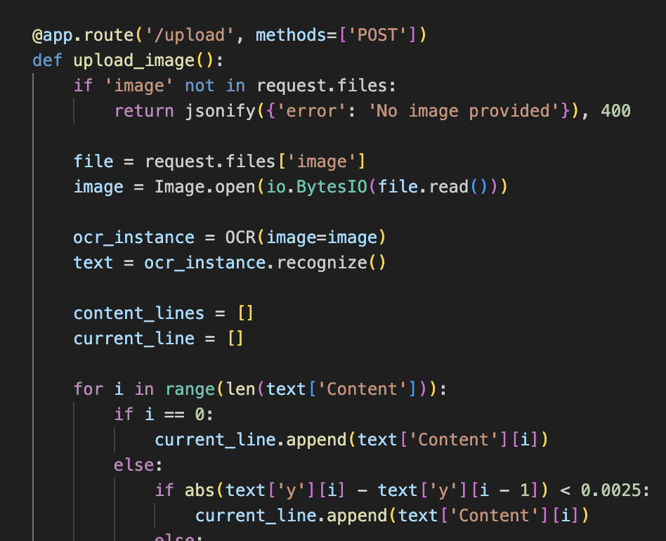
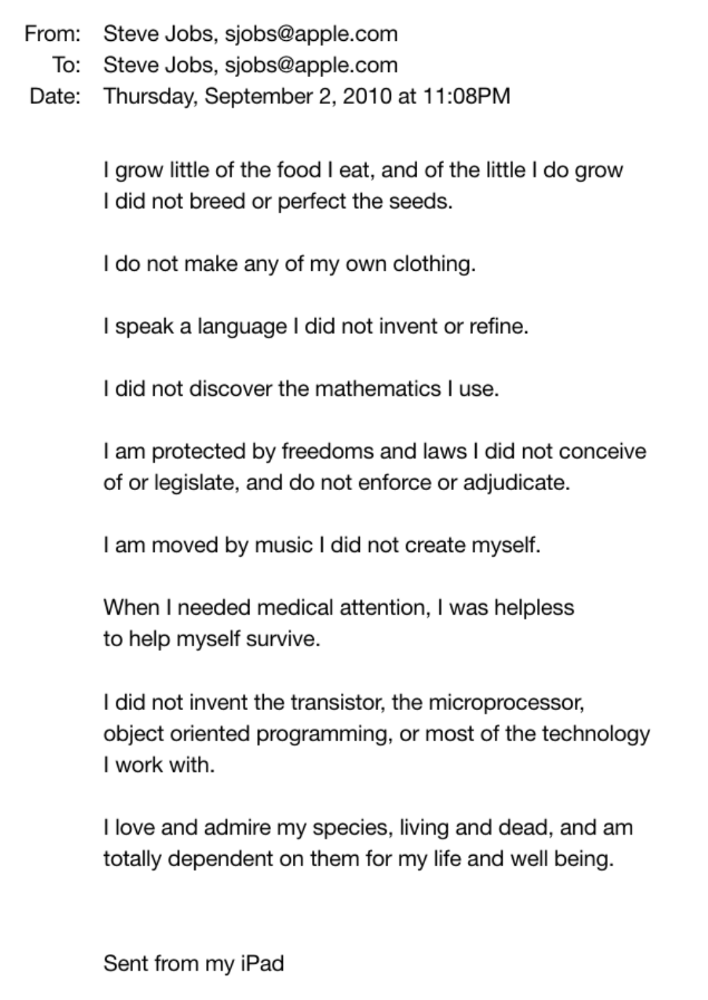
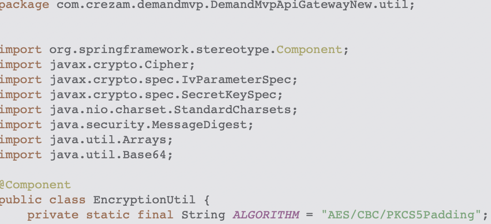

# XOCR
AppleOCR that has been specifically optimized to handle indentations, spacing etc (specifically for code)
This is very useful for cases where we need to extract code or formatted text from images.
Since it uses Apple Vision API, it is extrememy fast and accurate.
The downside is that this will only work on macos. The current implementation is in Swift (to allow for a single executable without any dependency issues) however, there is also a python implementation within the python folder

## usage
```bash
./xocr (image_path)
```

## compilation of swift code
```bash
swiftc xocr.swift -o xocr
```

# OCR Examples


```python
@app. route('/upload', methods=[ 'POST'])
def upload Limage () :
  if 'image' not in request.files:
    return jsonify({'error': 'No image provided'}), 400
  file = request. files l'image']
  image = Image-open (io.BytesI0(file.read()))
  ocr_instance = OCR (image=image)
  text = ocr_instance. recognize()
  content_ lines = [I
  current_line = []
  for i in range(len (text ['Content'])):
    if i == 0:
      current_line.append (text [ 'Content'] [il)
    else:
      if abs(textl'y'][il - textl'y'][i - 1]) < 0.0025:
        current_line.append (text ['Content'] [il)
```
<br>

```
From: Steve Jobs, sjobs@apple.com
To: Steve Jobs, sjobs@apple.com
Date: Thursday, September 2, 2010 at 11:08PM
    I grow little of the food I eat, and of the little I do grow
    I did not breed or perfect the seeds.
    I do not make any of my own clothing.
    I speak a language I did not invent or refine.
    I did not discover the mathematics I use.
    I am protected by freedoms and laws I did not conceive
    of or legislate, and do not enforce or adjudicate.
    I am moved by music I did not create myself.
    When I needed medical attention, I was helpless
    to help myself survive.
    I did not invent the transistor, the microprocessor,
    object oriented programming, or most of the technology
    I work with.
    I love and admire my species, living and dead, and am
    totally dependent on them for my life and well being.
    Sent from my iPad
```

<br>

```java
package com.crezam.demandmvp.DemandMvpApiGatewayNew.util;
import org.springframework.stereotype.Component;
import javax.crypto.Cipher;
import javax.crypto.spec. IvParameterSpec;
import javax.crypto.spec.SecretKeySpec;
import java.nio.charset.StandardCharsets;
import java.security.MessageDigest;
import java.util.Arrays;
import java.util.Base64;
@Component
public class EncryptionUtil {
  private static final String ALGORITHM = "AES/CBC/PKCS5Padding" ;
```

so as demonstrated, the output is fairly accurate and preservers the newlines, indentation, spacing & special characters.
Hence, this can be incredibly useful for Code specific OCR Tasks